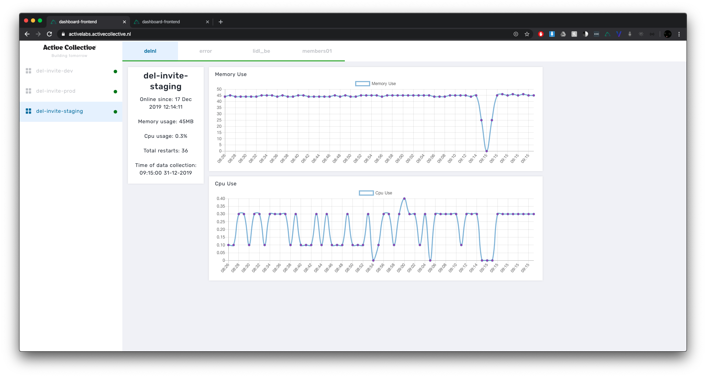
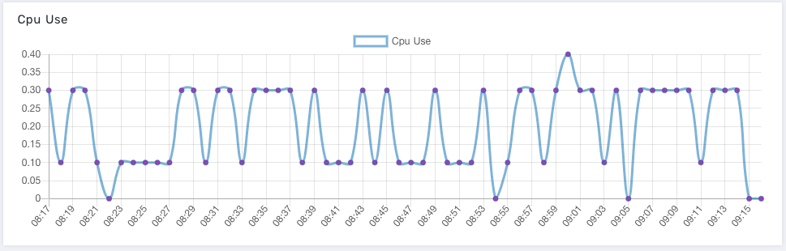

# Dashboard / Dashboard-api

#### API DOCS:[https://app.gitbook.com/@stage-verslag/s/dashboard-api/](https://app.gitbook.com/@stage-verslag/s/dashboard-api/)

#### Data ping model

Dit is de data die elke minuut naar de server wordt verstuurd en wordt gelogged in de database en File systems worden opgeslagen.

```javascript
const sendThis = {
            name: listItem.name ? listItem.name : null,
            site_name: process.env.NAME ? process.env.NAME : 'asdad',
            pid: listItem.pid ? listItem.pid : null,
            version: listItem.version ? listItem.version : null,
            created_at: listItem.pm2_env.created_at ? listItem.pm2_env.created_at : null,
            restart_time: listItem.pm2_env.restart_time ? listItem.pm2_env.restart_time : null,
            uptime: listItem.pm2_env.pm_uptime ? listItem.pm2_env.pm_uptime : null,
            memory_use: listItem.monit.memory ? listItem.monit.memory : null,
            cpu_use: listItem.monit.cpu ? listItem.monit.cpu : 0,
            time: moment().format('HH-MM-SS'),
            date: moment().format('DD-MM-YYYY')
      }
```

Wanneer de server een 65 seconden lang geen reactie heeft ontvangen van de server verstuurd de dashboard een message naar slack om de developers op de hoogte te brengen van het probleem.Dit zorgt er voor dat de servers niet al te lang offline zijn en dat de gebruiker er last van heeft.

De error wordt ook opgeslagen op de database zodat we later kunnen terug kijken wanneer we de error hadden en of er een correlatie in zit met de anderen database.

#### Data end-point

Dit zijn endpoints functies die je kan uitvoeren via een de API, de meeste endpoints zijn voor het verdelen en het laten zien van de data op de frontend.

```javascript
async function serveJSON (req, res) {
  fs.readFile(`data/${req.params.name}`, (err, data) => {
    if (err) {
      res.sendStatus(500)
    } else {
      let json = JSON.parse(data)
      res.send(json)
    }
  })
}
```

```javascript
  .get(`${process.env.PREFIX}/delete`, deleteJson.recentErrors)
  .get(`${process.env.PREFIX}/endpoints`, endpoints)
  .get(`${process.env.PREFIX}/recent`, serve.recent )
  .get(`${process.env.PREFIX}/recent-error`, serve.recentError)
  
  .get(`${process.env.PREFIX}/:server/:site/today`, serve.today )
  .get(`${process.env.PREFIX}/:server/:site/files`, serve.logFiles )
  .get(`${process.env.PREFIX}/:server/:site/:logs`, serve.server)
```

#### End-point voorbeeld

Met de endpoint `api/endpoints` krijg je elke server en website terug die gemonitord wordt door de server. De `"name": "no_server_name"` is een server die we monitoren met daar in de sites die op die server staan deze data kan worden opgehaald met een API `/api/no_server_name/pm2-slack/log-23-12-2019`

```javascript
{
    "id": "c2wju7qat50hjz5dqand6pst8",
    "name": "no_server_name",
    "sites": [
      {
        "id": "2zjyq2rdvriohwr012v38vmm9",
        "name": "pm2-slack",
        "endpoint": "/no_server_name/pm2-slack",
        "error": false
      },
      {
        "id": "8neus8z12awsawwgz1gqvzjfo",
        "name": "pm3-slack",
        "endpoint": "/no_server_name/pm3-slack",
        "error": false
      },
      {
        "id": "cm2i9e7c0ya0lzk937q9tpxwj",
        "name": "pm4-slack",
        "endpoint": "/no_server_name/pm4-slack",
        "error": false
      }
    ],
    "error": false
  },
```

#### Endpoint return 

De endpoint die we net hebben aangeroepen `/api/no_server_name/pm2-slack/log-23-12-2019` geeft een return van de server deze zal er ongeveer zo uit zien

```javascript
[{
    "server_name": "no_server_name",
    "name": "pm2-slack",
    "pid": 546,
    "version": null,
    "created_at": 1577106670046,
    "status": "online",
    "restart_time": null,
    "unstable_restarts": 0,
    "uptime": "23 Dec 2019 14:11:10",
    "memory_use": 36,
    "cpu_use": 0.2,
    "time": "14:12:00",
    "date": "23-12-2019"
  }]
```

Eentje is nog niet erg interessant maar als we er 100 of duizend hebben kunnen we een activity graph maken op een dashboard en kunnen we de quality van een server beter waarnemen.

#### Front-end

Voor de front-end hebben we de stack van Deloitte gebruikt, dit zorgde voor kwalitatief betere development. Door het te hergebruiken van eerder gemaakte en geteste onderdelen kunnen we snel aanpassingen maken aan de codebase. Samen heb ik met Bas\(collega\) het grootste deel van de front-end gemaakt.





Elke van deze punten is een data object die hier boven is beschreven, samen maken ze deze grafieken.

## 

