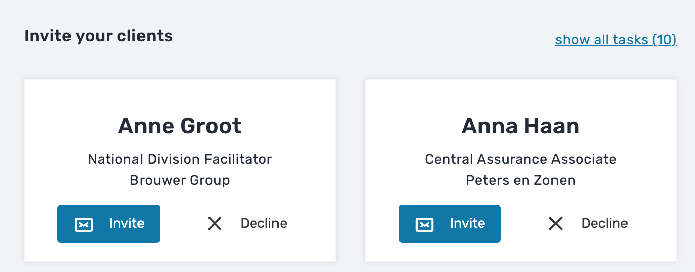
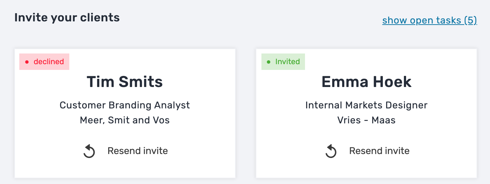
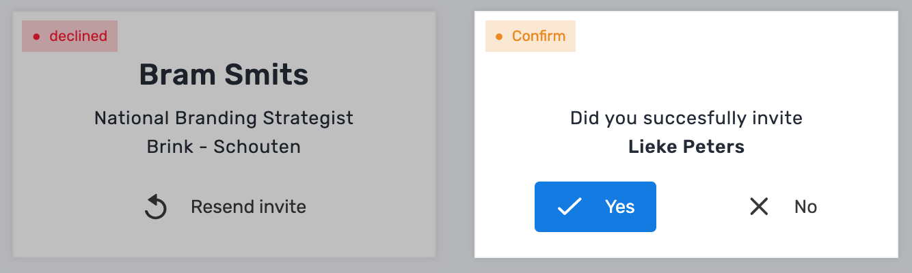
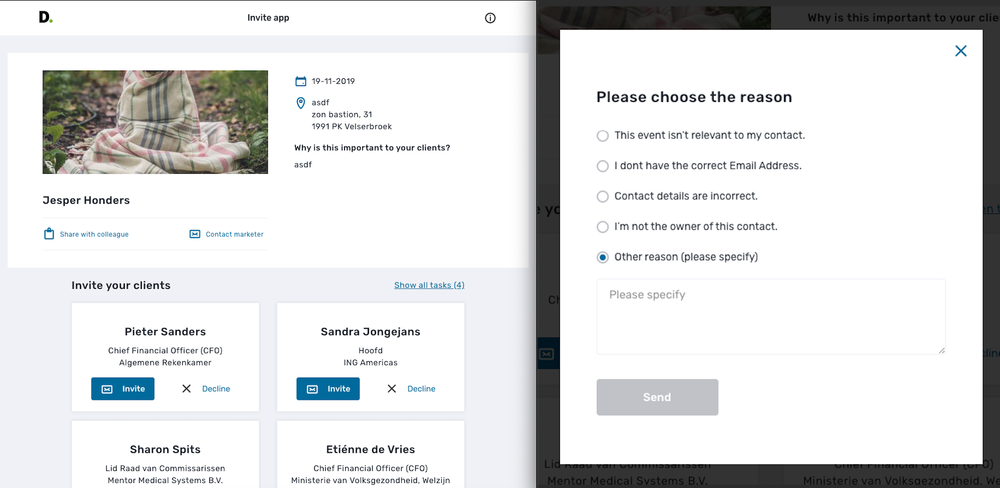

# Deloitte

Voor Deloitte hebben we een app gemaak waar mee de gebruik zelf erg makkelijk zijn clients kan inviten voor een event. Dit is voor de gebruikers erg handig omdat ze een template wordt gemaakt die ze kunnen gebruiken voor iedereen.

### Wie is Deloitte?

Deloitte is een bedrijf die diensten levert in deze disciplines [Accountancy](https://nl.wikipedia.org/wiki/Accountant), [Belastingadvies](https://nl.wikipedia.org/wiki/Belastingadviseur), [Consultancy](https://nl.wikipedia.org/wiki/Adviesbureau), [Financieel advies](https://nl.wikipedia.org/wiki/Financieel_adviseur) en [Juridisch advies](https://nl.wikipedia.org/w/index.php?title=Juridisch_advies&action=edit&redlink=1) 

#### Animatie:

Voor de elementen die steeds veranderen heb ik een animatie gemaakt in Css, om dit process beter te laten verlopen.

```css
 .fadein-card{
    animation: fadein-card ;
    animation-duration: .5s;
  }
  @keyframes fadein-card {
    from {
      opacity: 0;
      transform: translateX(20px);
    }
    to {
      opacity: 1;
      transform: translateX(0px);
    }
  }
```

De animatie hier boven is vrij simple maar geeft het effect dat de element verwisseld worden.

#### Features:

De Deloitte app maakt het makkelijker om je clienten lijst te mailen. Hier voor maken hebben we een systeem gemaakt dat een standaard mail in je mail app copied en zodat je een standaart mail heb voor al je clienten. De clienten worden aangegeven door het CMS die gebonden is aan het Deloitte account.





Wanneer je de stappen heb doorlopen en de mail is geopend vraagt de app of jij succesvol de client heb geinvite in het systeem. Wanneer je hier `Yes` op antwoord zal het element uit view sliden en veranderen naar een `invited` en zal de overlay weg vallen zo dat je de app weer kan gebruiken.



#### Atoms / Molecules /Organisms.

Voor Deloitte heb ik meerderen Atoms/Molecules en Organisms gemaakt dit zijn ze in de werking van de app.



#### Branchs.

Voor elk onderdeel van de app maken we een aparte branch aan, zo houden we alles van elkaar geisoleerd en kan iedereen aan z'n onderdeel werken zonder dat anderen je collega's op je moeten wachten.

#### Brance naming:

Voor de namen hebben we een "naming convention" dit houdt in dat we voor de naam van de branch het type branch doen. Zoals `"/feature"` voor een feature of `"/bugfix"` voor het fixen van bugs.

Dit houdt alles log van elkaar en makkelijk te controleren in het develop proces.

#### Bijdragen.

Dit project heb ik gewerkt aan de Atoms / Molecules /Organisms en heb ik css animaties gemaakt. Dit zorgt ervoor dat de app er gelikter uitziet en meer voelt als een app wanneer de eind gebruiker hier me werkt.

#### Front-end testing.

Voor Deloitte hebben we internen testen gedaan en externe testen, hier kwam feedback uit en deze in verwerkt. Hier na is de app naar een externe tester geweest van Deloitte om de app te testen.


