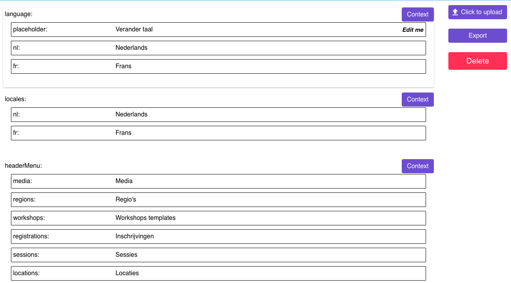
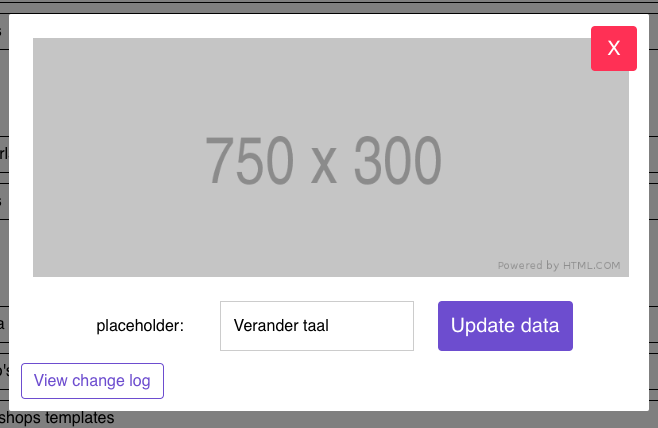
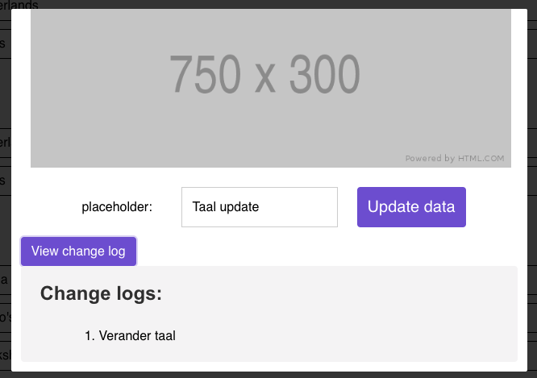
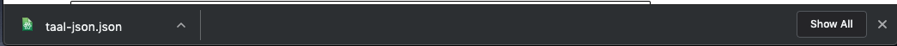
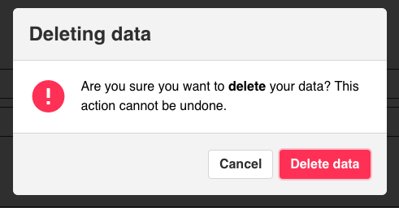

# Json translation tool

**Website**: [http://translation.activecollective.nl/](http://translation.activecollective.nl/)

#### Json translation tool

Deze translation tool gaat gebruikt worden door Lidl Belgie en intern met het helpen van het vertalen van de Frans en Nederlandse website. De app moet de vertaler context en inzicht geven aan de text die vertaald moet worden. De app kan daarna de nieuwe data exporteren naar een Json bestand zo dat de front-ender deze kan uploaden naar de server zonder errors.

#### Recursive rendering

Om deze app zo generaal mogelijk te maken is de rendering van de elementen recursive, dit houdt in dat de Json elke mogelijk vorm kan zijn en dat het voor de app zelf niet uitmaakt. Hier onder de door mij gebruikt voorbeeld van de data structure.


```javascript
  {
    "__meta": {
      "__rootUrl": "https://www.google.nl",
      "language": "Alles over taal",
      "generalTable": "Table met generale opties van de site"
    },
    "language": {
      "__meta": {
        "__url": "/is_dit_relevant?",
        "placeholder": "explanation",
        "nl": "Nederlands"
      },
      "placeholder": "Verander taal",
      "nl": "Nederlands",
      "fr": "Frans"
    }
  }
```




#### Data structuur in actie

Dit is hoe de data er uitziet wanneer het gerenderd is door de app.



Via deze template wordt de data displayed aan de user

```markup
 <Tree :depth="depth + 1"
       :name="name"
       :node="item"
       :prevName="location(name)"
       class=""
       v-if="!item.length"

 />
```

#### Edit de data.



Wanneer er op de text wordt geclickt laat de app een modal zien, met daar in de optie om de text aan te passen en de change history te bekijken. Ook gaan we in een latere sprint een context toevoegen dat de user ziet waar de data aangepast gaat worden, dit is nu op de plaats van de 750x300 placeholder.

#### Change history

Voor de het gebruik gemak van de gebruiker houden we een local change log bij, dit zorgt er voor dat de gebruik kan zien welke aanpassingen hij of zij hebben gemaakt in de data. Dit laat ze de iteraties zien in het vertaal process.



De veranderingen worden naar de local storage geschreven zodat we ze later kunnen ophalen. Hier onder is de code hoe het werkt, de code checkt eerst of het object bestaat en wanneer dat niet het geval is zal de code deze aanmaken en de data daar in opslaan.

```javascript
      writeToLogbook: function () {
        const path = `${this.$store.state.popUp.parents}.${this.$store.state.popUp.name}`

        if (path in localStorage) {
          const localstorageJson = JSON.parse(localStorage.getItem(path))
          // Add data to the logbook
          localstorageJson.changeLog.push(this.localValue)
          localStorage.setItem(path, JSON.stringify(localstorageJson))

        } else {
          // Create the Localstorage object
          const localStorageData = {
            path: path,
            parents: this.$store.state.popUp.parents,
            name: this.$store.state.popUp.name,
            changeLog: [`${this.$store.state.popUp.item}`],
            prevValue: this.$store.state.popUp.item
          }
          localStorage.setItem(path, JSON.stringify(localStorageData))
        }
      },
```

Het ophalen van de local storage.

```javascript
     const path = `${this.$store.state.popUp.parents}.${this.$store.state.popUp.name}`
        this.logbook = JSON.parse(localStorage.getItem(path))
      },
      checkStorage () {
        if (this.logbook !== null) {
          this.$store.dispatch('logBookUpdate', true)
        } else {
          this.$store.dispatch('logBookUpdate', false)
        }
      }
```

#### Exporting data.

De vertaler moet wanneer hij of zij klaar is met vertalen de vertaling op kunnen sturen naar de developers die dan de site kunnen updaten in de correcten taal. Hier door moet de vertaler het bestand kunnen downloaden zonder zorgen dat de data niet correct in het bestand staat.

```javascript
   saveFile: function () {
        const data = JSON.stringify(this.$props.node, null, 2)
        const blob = new Blob([data], {type: 'text/json;charset=utf-8'})
        const e = document.createEvent('MouseEvents'),
          a = document.createElement('a')
        a.download = 'taal-json.json'
        a.href = window.URL.createObjectURL(blob)
        a.dataset.downloadurl = ['taal-json/json', a.download, a.href].join(':')
        e.initEvent('click', true, false, window, 0, 0, 0, 0, 0, false, false, false, false, 0, null)
        a.dispatchEvent(e)
      }
```



#### Data deleting.

Het verwijderen van de data, dit wordt gebruik voor als iemand het verkeerde document heeft ingevoerd de gebruiker kan dan in een keer alles weg gooien.



De data wordt dan gedelete door de Vuejs data store naar leeg te zetten, zo update hij gelijk de site terug naar de empty state.

```javascript
deleteFile: function () {
        this.$store.dispatch('setJsonData', [])
        },
```

