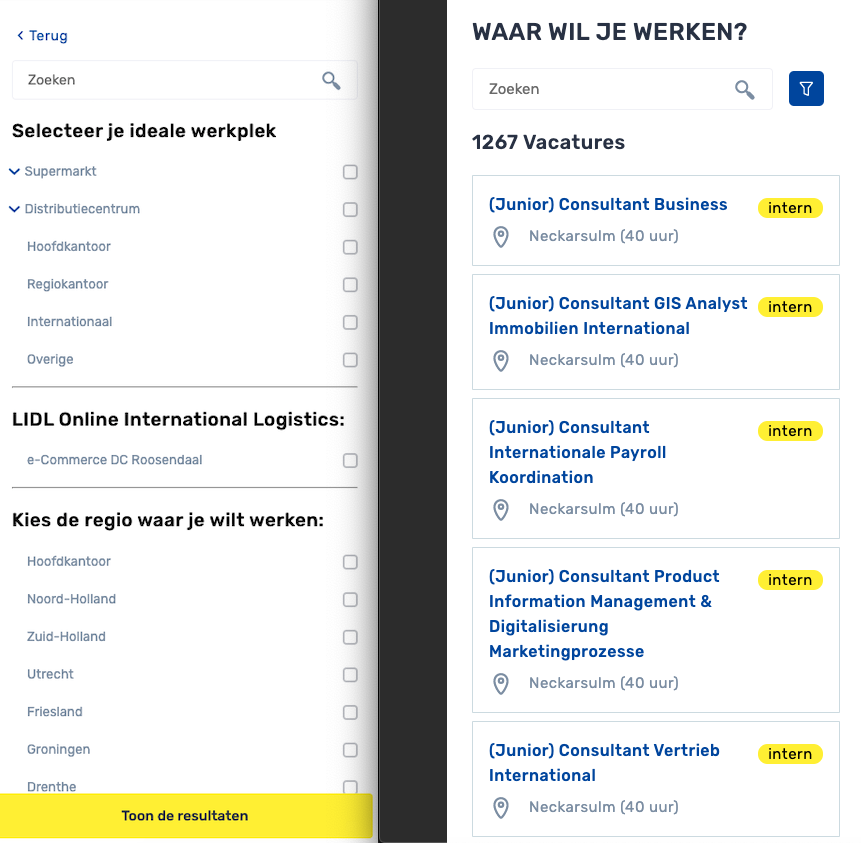
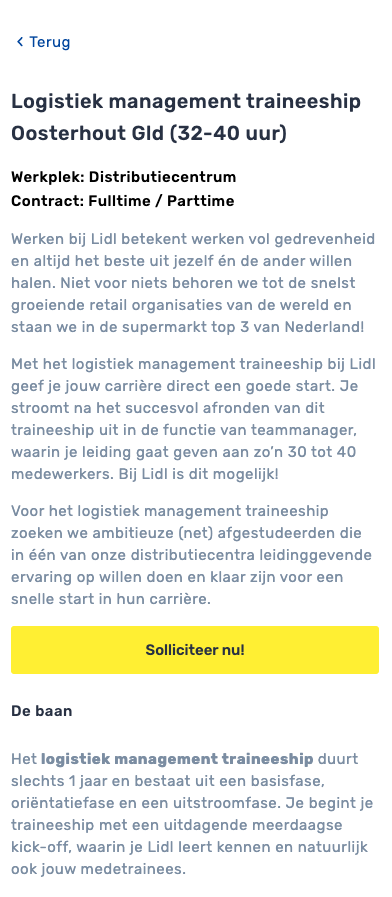
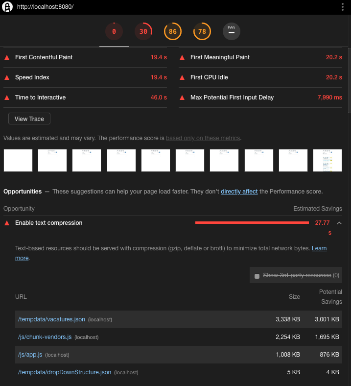
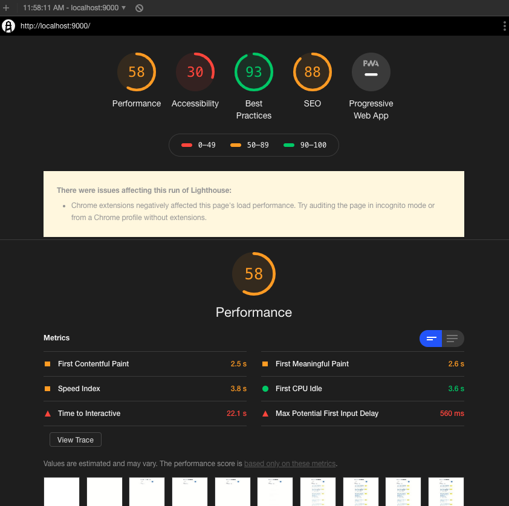

# Lidl jobs

## Lidl Jobs

Voor Lidl heb ik een web app gemaakt die de open staande vacatures laat zien in Lidl Nederland. Deze app werkt bij hun intern dus heb er geen zicht op hoe deze werkt en hoe het wordt gebruikt door de eind gebruiker want ik persoonlijk erg jammer vindt. Door met de data te werken in deze app viel me wel op data de Lidl erg snel door hun personeel heen brand omdat er steeds meer dan 1200 vacatures openstaan 

### Design





#### Data

De Lidl vacaturen API was niet aanwezig dus heeft Raymond eerst een [webcrawler](https://nl.wikipedia.org/wiki/Spider) moeten maken om de Lidl site omzetten naar data die ik kon gebruiken in de app. Daar na haal ik met Axios de de data op en zet dit in een data object.

```javascript
    mounted () {
      this.scroll()
      this.axios
      // .get('/tempdata/425bd15784d955e03ce9c9bbf22f8c48.json')
        .get('data/425bd15784d955e03ce9c9bbf22f8c48.json')
        .then(response => {
          this.offersData = response
          this.jobsData = response.data
        })
    }
```

#### Filter.

De filter in de deze app was zeker de grootste uitdaging omdat ik nog nooit zo'n complexe filter heb gemaakt tijdens de studie.

#### Hoe werkt het filter?

Het filter gaat met een loop door elk data element uit de data, dan doe ik een match of het data element voldoet aan de paramaters van de search en als hij dat niet doet return ik `false` en valt hij uit de loop. Ook veranderd het alles naar lowercase zodat de user zijn/haar search input niet hoofdletter gevoelig is want dat is altijd irritant wanneer dat niet werkt.

```javascript
  if (array.length > 0) {
     let result = array.filter(item => item.value.toLowerCase() === data.key.toLowerCase())
     if (result.length === 0) {
      return false
     }
    }
```

Door de code hier onder kan de gebruiker zeer verfijnt zoeken door de data omdat hij/zij nu ook nog door de titels van de eerder gefilterde data kan zoeken.

```javascript
if (data.titel && !data.titel.toLowerCase().includes(this.search)) {
     return false
}
```

### Dropdown menu

Voor de filter pagina was er een dropdown menu nodig zodat de gebruiker sneller door de site kon zoeken en deze functions ook nog duidelijk zichtbaar zijn.

#### Dropdown menu structuur

Voor de dropdown heb ik een data structuur gemaakt die het design na bootst en heb ik hier `values` aan gelinkt zo dat ik deze kon matchen met de data uit de crawler. De data heeft ook of deze open of dicht is en of deze subitems heeft waar weer meer op verfijnt kan worden. _\(Data is ingekort voor leesbaarheid\)_

```javascript
  {
    "id": "werkplek",
    "name": "Selecteer je ideale werkplek",
    "items": [
      {
        "name": "Supermarkt",
        "value": "Supermarkt",
        "status": false,
        "hasDrop": true,
        "isOpen": false,
        "subItems": [
          {
            "name": "Hulpkracht",
            "value": "Hulpkracht",
            "status": false
          },
          {
            "name": "Supermarktmedewerker",
            "value": "Supermarktmedewerker",
            "status": false
          },
          {
            "name": "Assistent Supermarktmanager",
            "value": "Assistent Supermarktmanager",
            "status": false
          }
        ]
      },
      {
        "name": "Hoofdkantoor",
        "value": "Hoofdkantoor",
        "status": false
      }
    ]
  },
```

### Data overload

De data uit de API is erg groot/veel dit zorgt er voor dat de app langzaam is met het inladen van de juiste HTML/CSS, dit is natuurlijk een probleem voor de gebruik met een langzamen verbinding of ouderen telefoon. Het grootste probleem is het renderen van 1280 elementen wanneer je de app opent dit is erg veel en langzaam.



De oplossing die ik heb gemaak is het maken van een `render` limit. De app laat eerst maar keer maar 20 elementen in dit zorgt er voor dat de app veel sneller klaar is met opbouwen, als de gebruiker meer van de data wil zien kan hij/zij door de pagina scrollen en wanneer hij/zij onderaan is worden er 20 meer elementen ingeladen in de app.



Verder wild ik het loaden nog sneller maken door gebruik van een aantal technieken maar kan ik dit alleen nog doen als de site [server-side gerendered ](https://alligator.io/react/server-side-rendering/)was en dat was niet mogelijk.


