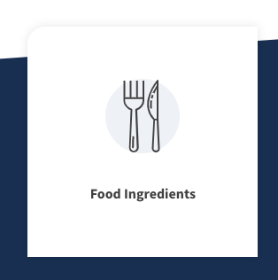

# Will en co

Will & Co is distributeur van chemicaliën, grondstoffen voor industriële toepassingen en ingrediënten.

Voor Will & co heeft Active collective een bedrijfs website gemaakt en die moest geupdate worden ook moesten er smooth animaties op de website komen. Hier heb ik met Vue animaties gewerkt, dit zit ingebouwd in Vue voor animaties.

### Wat is Will en co?

"Will & Co is distributeur van grondstoffen en chemicaliën voor industriële toepassingen \(van chemicals tot biobased\) en food ingredients. Als gespecialiseerde kennispartner adviseren we productiebedrijven over kwalitatief hoogwaardige grondstoffen en distribueren deze aan onze klanten." \(Bron Will & co\)

### Menu transition

De website had nog geen transition in het menu, deze heb ik toegevoegd aan de site zodat het een betere ervaring is voor de gebruiker. Deze animatie is gemaakt met Vue



#### **HMTL**

```markup
  <transition
      enter-active-class="slideEnter"
      leave-active-class="slideLeave"
      mode="out-in"
      name="fade"
    >
```

#### Css

```css
  .fade-enter-active,
  .fade-leave-active {
    transition: $transition-enter;
  }

  .slideEnter {
    transition: $transition-enter;
    z-index: -1;
    position: relative;
  }

  .slideLeave {
    /*the .05s fixes a safari issue*/
    transition: all 0.5s cubic-bezier(.25, .8, .25, 1) .05s;
    z-index: -5;
    position: relative;
    transform: translateY(-400px);
  }

  .fade-enter {
    z-index: -1;
    position: relative;
    transform: translateY(-400px);
  }
```

### Parallax

De parallax is gemaakt met het vue component vue-parallax-js. Door een value aan te passen krijg je het omhoog bewegende effect.



De parallax elementen.

```markup
    <div class="o-wrapper u-relative">
      <div v-parallax="-0.2" class="triangle triangle-1 parallax"></div>
      <div v-parallax="-0.3" class="triangle triangle-2 parallax"></div>
      <div v-parallax="-0.25" class="triangle triangle-3 parallax"></div>
    </div>
```

#### Hover states

De website had geen hover states om te laten zien waar de gebruiker over heen hovered deze heb ik toegevoegd om de gebruiker beter richting te geven.




De hover state is HTML en CSS dit wordt gedaan door een extra element die buiten het element valt te maken, deze wordt op `:hover` omhoog gehaald met een transition zo dat het een smooth effect geeft.

**HTML**

```markup
    <div class="industry-tile-dropdown" :class="{'is-mobile': isMobile}">
      <nuxt-link :to="link">
        <AtomMedia isRound class="industry-tile-dropdown__image u-margin-right" :src="image"></AtomMedia>
        <AtomTextBody class="u-margin-right-large">{{title}}</AtomTextBody>
        <div class="industry-tile-dropdown__icon">
          <AtomIcon type="arrow-right"></AtomIcon>
        </div>
        <div class="industry-tile-dropdown-bar"></div>

      </nuxt-link>
    </div>
```

**Css**

```css
 .industry-tile-dropdown:hover .industry-tile-dropdown-bar{
    left: 0;
  }

  .industry-tile-dropdown-bar{
    width: 5px;
    top: 0;
    left: -5px;
    height: 100%;
    background-color: $color-palette-orange;
    position: absolute;
    transition:$transition-enter;
  }
```

Voor Will en Co blijven we updates leveren.

#### 19-11-19: Update

Will en co heeft updates op de website gemaakt, hier door kwam een issue naar boven die we dan moeten fixen gelukkig was dit niet een al te grote ingreep op de website.

Will en co [https://www.will-co.eu/nl/](https://www.will-co.eu/nl/)

Gebruikte parallax plugin: [https://jsnanigans.github.io/vue-parallax-js/](https://jsnanigans.github.io/vue-parallax-js/)

