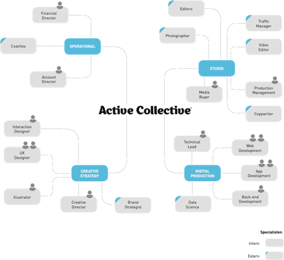

# Observatie opdracht

## Van ontwerp naar app / product

Voor de observatie opdracht heb ik bij meerdere meetings met de klant gezeten. Hier wordt vooral het doel van de app / het product besproken. Ook bespraken we de verschillende technieken die we kunnen gebruiken. Tijdens deze gesprekken worden er ook schetsen en notities gemaakt en technieken verder uitgedacht en besproken.

Na de meeting beginnen de designers met het maken van een wireframe, hierna wordt deze verwerkt naar een klikbaar prototype en wordt deze naar de klant toegestuurd. We vragen de klant om dit prototype goed te testen en ons hun feedback en vragen duidelijk door te geven. Als het een groot project is wordt na dit ontwerp nog een extra meeting gemaakt om de feedback door te nemen en te verwerken. Daarna kunnen we door naar de volgende fase, het visual design.

Tijdens de wireframe fase zijn de developers bezig met het opzetten van de mogelijke backend en de frontend stack. Ook worden er al onderdelen gemaakt die zeker in het product moeten komen zoals een formulier checker. Het opzetten van een project kost veel tijd dus terwijl wij dit doen zullen de designers een visual design maken.

De designers maken het visual design en een huis stijl samen met wat base elementen die worden goed gekeurd. Zo kunnen de developers al beginnen met het opzetten van een basis app. Wanneer het visual design is goed gekeurd kunnen de developers echt beginnen met developen. Tijdens dit proces zijn we aan het developen en sturen we elke week een update naar de klant toe waar we zijn in het develop proces. Wanneer het product "klaar" is blijkt uit ervaring dat de klant aanvullende wensen heeft. Dit komt doordat de gebruiker / product owner ook in het proces groeit en dan aanpassingen wil.

## Teamwork Front en Back-end

Teamwork met front en back-end is redelijk simpel. We gebruiken Nuxt en Node deze server regelt de backend code in Javascript. Dat is iets wat de frontenders hier ook kunnen waardoor we veel van de klassieke server dingen zelf kunnen regelen. Wanneer er wel PHP en of een server API aan te pas moet komen hebben we hier een  software engineer voor. Hij vraagt aan de frontenders wat er verwacht wordt van de app en maakt dit passend in de API en of PHP. Wanneer dit niet werkt wordt er meestal voor een oplossing in Nuxt gekeken.

De software engineer regelt ook de servers die we hebben draaien en de aanpassingen die gedaan moeten worden voor het product.

Het teamwork met de back-end is minder dan ik in het begin had verwacht, dit komt door Node en Nuxt.

## Bedrijfsorganisatie en planning

Een design wordt als eerste opgedeeld in stukken door de developers. Tijdens het opdelen ramen ze ook het aantal uren. Dit is de inschatting van de tijd dat het ongeveer gaat duren. Wanneer dit is gedaan wordt het door gegeven aan onze product leader. De product leader zal dan de weken in plannen voor zowel de designers als de developers.

Zie hier het organogram.

