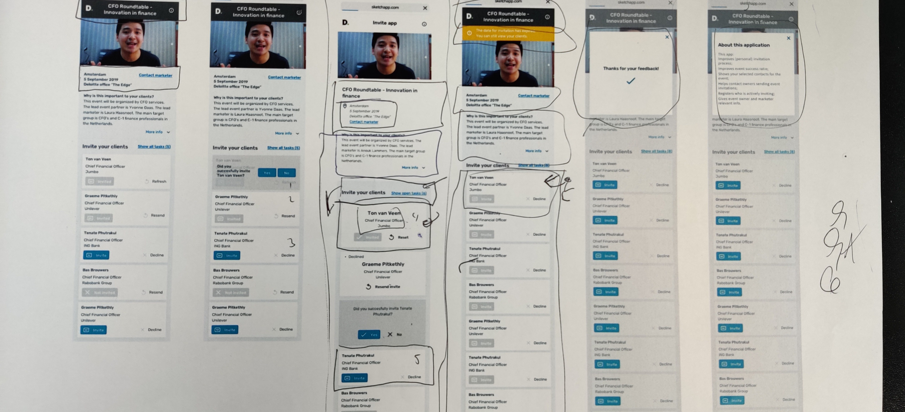
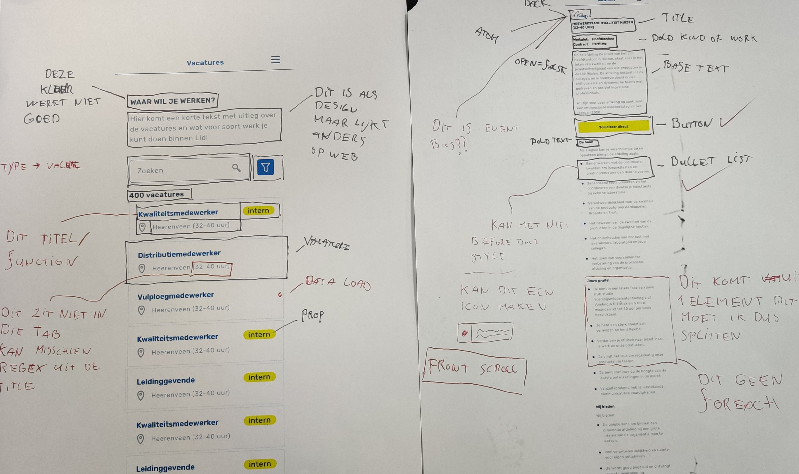
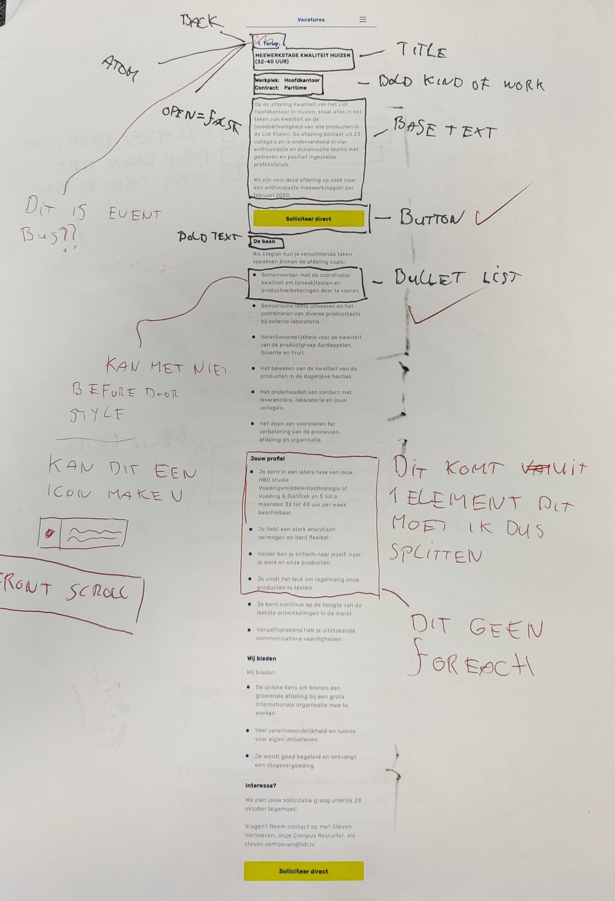

# Werk inschatten en urenboeken

## Json-Translating tool

Voor de Json translate tool heb ik geen uren inschatting voor hoeven doen maar had ik gewoon drie weken de tijd gehad om dit project te realiseren wat meer dan genoeg tijd was om dit project goed afteronden.

## Uren inschatten

#### Conclusie

Om de uren inschatten delen we de site op in verschillende stukken deze noemen we Molecules, Atoms en Organisms. Zo kan je de tijd per Atoms worden ingeschat en de site in bouw blokken worden opgebouwd. Deze elementen zijn herbruikbaar en daardoor financial beter dan de elementen maken die niet op deze manier werken.

15-10-19: De uren inschatting is redelijk kort, sommige elementen die meer Vue nodig hadden heb ik zeker meer tijd voor nodig.

### Lidl vacature app.

De Lidl vacature app was een individueel project, hier voor moest ik zelf ook uren inschatten. De uren waren in de meeste gevallen te ruim ingeschat en was ik eerder klaar met onderdelen. Dit komt door het gebruik van Vue.js hier door kon ik een stuk sneller developen dan dat ik had verwacht.

Het enige onderdeel waar ik te weinig uren op had ingeschat is het maken van de dropdown deze dropdown was een goede uitdaging.

Het uren inschatten en verwerken ging het zelfde als bij Deloite. \(Zie fotos\)

### Uren boeken.

Bij Active Collective werken we met Productive een app waar je taken kan  aan maken en aan anderen personen of je zelf kan hangen. Zo delen we het project op in kleinen taken, aan die taken worden uren gekoppeld.

Dit vormt een taken lijst die je moet maken voor het project met de geschatte tijd en waarden van het project. Zo kan je als team beter op schema blijven tijdens het project en weet je wat je teamgenoten aan het doen zijn.

Bij Active collective heeft slack een bot die je helpt herinneren je uren te boeken.

_Sidenote: Bij de weekly standup komt er vaker voor dat niet iedereen goed zijn uren bij houd, dus misschien is het developers eigen._

Productive: [https://www.productive.io/](https://www.productive.io/)

